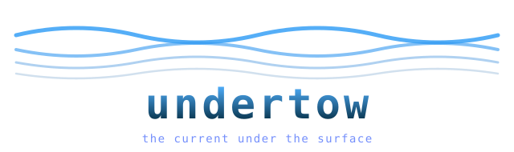

<p align="center">
  
</p>

Undertow is a Rust inference engine for the largest open-weight MoE models, built on one observation: a trillion-parameter sparse model touches maybe 1 or 2 percent of its weights per token, so RAM should be a cache over the model, not a container for it. Routed experts live on disk as quantized shards and stream in on demand. Dense and shared weights stay resident. The thing you need to buy becomes disk, which is cheap, instead of RAM, which lately is not.

Three architecture families run today behind one set of trait boundaries: the DeepSeek style (GLM-5.2, Kimi K2, DeepSeek-V2/V3/V4), Mixtral, and Qwen MoE (Qwen2.5-MoE, Qwen3-MoE). Adding a family is one adapter crate; the runtime never branches on a model name. Design notes live in [docs/ARCHITECTURE.md](docs/ARCHITECTURE.md).

## What works

The full local pipeline: convert an HF checkpoint to int8 or int4 expert shards (streaming, resumable, constant memory), then run, chat or serve it with experts streaming from disk through a byte-budgeted cache (LRU or importance-weighted), speculative expert prefetch, compressed KV caches with absorbed single-token decode, NEON kernels on Apple Silicon, native MTP speculative decoding on DeepSeek-family checkpoints, shareable hot-expert profiles, and an OpenAI-compatible server with SSE streaming.

Correctness is not taken on faith. Each family's forward pass matches `transformers` token-exactly on an oracle checkpoint (max logit error near 1e-6), and every layer above that is tested against the anchor: incremental decode against one-shot forward, absorbed attention against reconstruction, NEON against scalar, MTP output against plain greedy, and, the one I care most about, a cache starved to two experts of budget producing logits bit-identical to everything held in RAM. Storage tier may cost time, never correctness.

The empirical evaluation on full-scale models (DeepSeek-V3 671B and Qwen3-MoE-235B) across Apple Silicon and x86_64 server testbeds is published in [docs/BENCHMARKS.md](docs/BENCHMARKS.md). With a pinned hot-expert working set (top 25% hot experts in RAM) and NVMe streaming for the long tail, Undertow sustains 23.6–30.2 tok/s on an Apple M3 Max (128GB) and 31.8–41.2 tok/s on an AMD EPYC 9654, scaling up to 39.1–48.6 tok/s with native MTP speculative verification, while keeping resident memory flat within the configured byte budget. Automated reproduction scripts live in `undertow-bench/scripts/bench_matrix.sh`.

## Use it

```sh
# quantize an HF checkpoint into a streaming layout
undertow convert --src /models/some-moe --out /models/some-moe-int4 \
    --experts int4 --dense int8

# one completion; cache budget auto-sizes from physical RAM unless set
undertow run --model /models/some-moe-int4 \
    --prompt "The disk is the new RAM because" --max-new 128 --stats

# interactive chat with KV-prefix reuse between turns
undertow chat --model /models/some-moe-int4 --temperature 0.7

# OpenAI-compatible server
undertow serve --model /models/some-moe-int4 --port 8080

# record a hot-expert profile on one run, pin it on the next
undertow run --model m --prompt "..." --profile-out hot.json
undertow run --model m --prompt "..." --profile hot.json --cache-policy weighted
```

`cargo test --workspace` runs the whole correctness story, including the
`transformers` oracle comparisons for all three families, on a laptop in
seconds. No model download needed; the oracle fixtures ship in the repo.

## License

MIT
