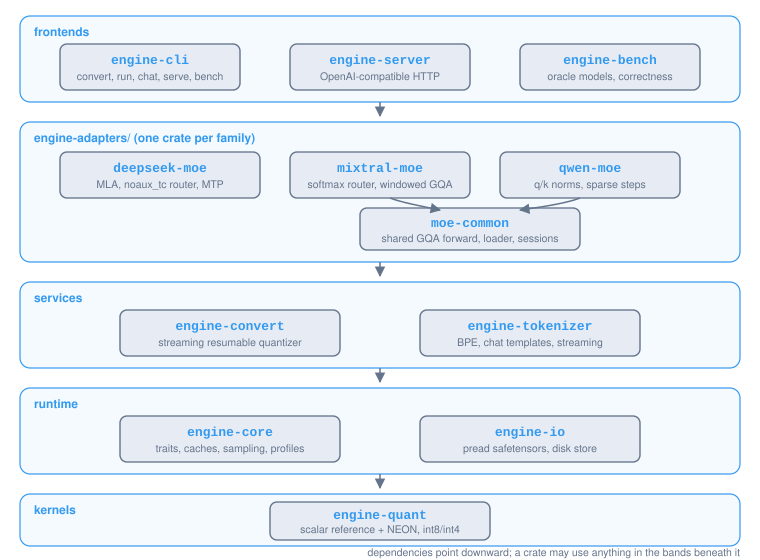
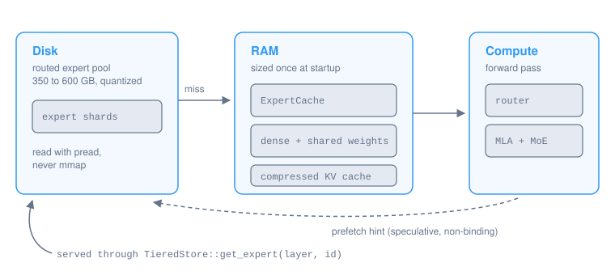

# Architecture

This is a description of what is actually built and why it has the shape it has. If something here disagrees with the code, the code wins and this file has a bug.

## Crate map

<p align="center">
  
</p>

`undertow-quant` sits at the bottom: quantized weight storage, scalar reference kernels, and SIMD implementations (NEON on aarch64, AVX2+FMA on x86_64 with runtime feature detection) that are property-tested against the scalar ones (the scalar path stays the source of truth on every platform). `undertow-core` owns the trait vocabulary plus everything every frontend shares: the caches, sampling, memory detection, hot-expert profiles, and the family-agnostic `Model` and `Session` traits the CLI and server drive inference through. Adapters live one crate per architecture family; Mixtral and Qwen3-MoE share their forward pass through `undertow-moe-common` because they differ only in naming, router normalization and two attention details. The runtime never branches on a model name; the CLI's registry maps `config.json` `model_type` to an adapter, and that is the only place family names appear together.

## The two traits that matter

**`RouterAdapter` is pure selection math.** It receives gate logits the caller already computed and returns chosen experts with combination weights:

```rust
fn route(&self, gate_logits: &[f32], correction_bias: Option<&[f32]>) -> Vec<ExpertChoice>;
```

Keeping I/O, batching and caching out of this signature means a router implementation is a deterministic function you can unit test against values computed by hand, which is exactly what the tests do. Two implementations exist: the DeepSeek sigmoid noaux_tc router (bias-corrected selection that never leaks into weights, group-limited top-k, `norm_topk_prob`, `routed_scaling_factor`) and the generic softmax top-k router that covers Mixtral (always renormalized) and Qwen (renormalization behind a flag).

**`TieredStore` is the streaming boundary.** The MoE block reaches routed-expert weights only through `get_expert(layer, id)`.

<p align="center">
  
</p>

`DiskExpertStore` serves a miss with three `pread` calls into buffers we own, inserts the quantized bytes into a byte-budgeted cache, and honors pins that survive any churn. Two eviction policies plug in behind the `ExpertCache` trait: plain LRU, and an importance-weighted policy where each entry carries an exponentially decayed access score, so an expert routed every few tokens is effectively unevictable while a long-ago burst fades. Prefetch hints go through a bounded queue to a worker pool; a full queue drops the hint and counts it, because a lost hint costs a future cache miss while a blocked decode step costs latency right now. During single-token decode the engine speculatively runs layer L+1's router on layer L's post-attention state and hints the store, so expert fetches overlap compute.

Expert usage is recorded per key and exportable as a profile, a small JSON histogram that another machine can pin at load time. Activation skew is stable enough across users of the same model that a good profile turns a cold start into a warm one; the test suite demonstrates the limit case, a pinned working set producing zero misses.

The invariant the whole tier design hangs on, and the test I consider the most important in the repo: a cache starved to roughly two experts of budget must produce logits bit-identical to a fully resident store. Eviction may cost time, never correctness.

## Attention

Two families of attention live in the tree, each with a compressed per-layer KV cache and incremental decode validated against one-shot forward.

**MLA** (DeepSeek family) caches only the RMSNormed KV latent and the shared RoPEd key-rot vector: `kv_lora_rank + qk_rope_head_dim` floats per token per layer, a factor of about 57 less than full KV on GLM-5.2 class geometry. Prefill reconstructs k/v through `kv_b_proj` in one matmul; single-token decode uses weight absorption, folding `q_nope` through the K half of `kv_b` so scores read cached latents directly. Same math by linearity, tested against each other with quantized `kv_b` as well as f32, because absorption traverses the quantized matrix in a completely different access pattern and that is where a packing bug would hide. RoPE is the interleaved partial variant matching `transformers`' `apply_rotary_pos_emb_interleave`.

**GQA** (Mixtral, Qwen) caches roped keys and values per KV head, with NeoX full-dim RoPE, optional per-head q/k RMSNorm (Qwen3), and an optional sliding window (Mixtral). The equivalence tests sweep KV-head counts including multi-query, both norm settings, and window edge cases.

## Speculative decoding

DeepSeek-family checkpoints ship a native MTP layer that predicts token t+2 from the last hidden state at t and the embedding of t+1. The engine drafts one token with it and verifies draft plus sampled token in a single two-token prefill; accepted drafts halve the forwards per token, rejected ones roll back one KV position. The property that matters is losslessness: the emitted sequence is decided only by the main model's logits, so output is identical with MTP on or off. Two tests pin this from both sides, one with the oracle's random draft head (everything rejects, output unchanged) and one driving the same loop with a perfect self-consistent draft (everything accepts, output unchanged). Speculation supports both greedy decoding and stochastic sampling with speculative rejection sampling (Leviathan et al., 2023), guaranteeing that the sampled distribution matches the base model's true probabilities under any temperature or top_p.

## Quantization and conversion

`QTensor` stores f32, int8 or int4 with symmetric per-output-row scales; kernels dequantize inside the accumulation loop. Per-row scales make the converter's row-chunked streaming exact: quantizing in chunks of any size produces byte-identical output, and a test pins that. Numerically sensitive tensors never quantize: norms, router gates, biases, anything not a 2-D matrix. Each family ships its own conversion classifier, each with its own version of the same trap under test (the router's `.mlp.gate.weight` one substring from the very quantizable `.mlp.gate_proj.weight`).

`undertow convert` streams any supported checkpoint (f32, bf16, f16, sharded or not) into per-layer expert shards plus a dense shard, with a standard index json so one reader opens converted and unconverted models alike. Constant memory regardless of model size, atomic per-shard writes, resumable reruns, and a hard refusal on non-finite weights.

## How correctness is established

The anchor is a set of tiny random-weight checkpoints, one per family, each with the real architecture (dense prefixes, q-LoRA, expert groups, shared experts, q/k norms, an MTP layer) generated by a libm-free deterministic RNG so fixtures and golden references live in git. Each was run once through the upstream `transformers` implementation; the Rust forward pass must match teacher-forcing argmax at every position and the greedy continuation token for token, with max logit error near 1e-6.

Everything else is tested relative to that anchor, in a chain: quantized kernels against dequantized reference matmuls, SIMD (NEON and AVX2) against scalar, chunked conversion against whole-tensor, incremental against one-shot, absorbed against reconstructed, streaming against resident, MTP against plain greedy, server streaming against server unary. Drift tests regenerate every fixture and byte-compare, so a generator change cannot silently invalidate a golden file.

## The server

`undertow-server` puts an OpenAI-compatible surface over any `Model`: chat and text completions, SSE streaming, stop strings with holdback so a partial stop marker never reaches the client, and usage accounting. Generation runs single-flight behind a semaphore; one CPU-saturating forward pass at a time beats several thrashing each other's expert cache. The integration tests run against a live server over the oracle fixture with a byte-level tokenizer, so the whole HTTP to tokens to text path is exercised hermetically.

## Why pread and not mmap

With a 350 to 600 GB expert pool behind an 8 to 64 GB RAM budget, mmap hands residency decisions to the page cache, and RSS becomes something that happens to you rather than something you chose. That failure mode is worst on exactly the unified-memory machines this engine targets. Positioned reads into buffers we own keep RSS flat and leave residency to the cache policy. They are also offset-stateless, so concurrent expert fetches never fight over a shared file cursor; the concurrency tests lean on that directly.

To prevent the OS buffer cache from duplicating or polluting RAM during large generation runs, `undertow-io` bypasses kernel page caching by default:
- On macOS (Darwin/Apple Silicon), shard file descriptors are configured with `fcntl(fd, F_NOCACHE, 1)` at open, preventing XNU unified memory page compression and cache bloat.
- On Linux, read ranges are managed with `posix_fadvise(..., POSIX_FADV_DONTNEED)` and random access flags to promptly release kernel pages after reading.

## What is next

Full-size model benchmarks on real NVMe (the only item on this list blocked on hardware rather than code), AVX-512 and Intel AMX matrix extensions for high-end x86 workstations, and the distributed LAN-pooled store the `TieredStore` boundary was shaped for from the start.
