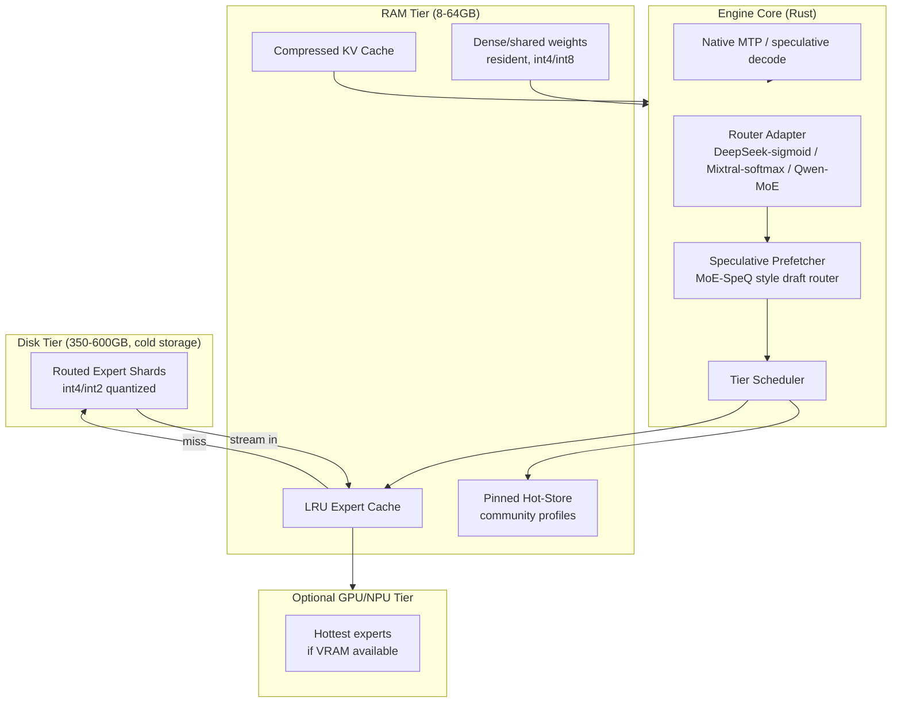

# Technical Proposal & Roadmap
## A generalized, Rust-native, tiered-memory inference engine for frontier open-weight MoE models

**Status:** Draft v1.0 — July 2026
**Author context:** Solo builder, background in distributed systems, Rust preferred, dev machine: MacBook Air M4 / 16GB unified memory

---

## 0. TL;DR

`llama.cpp`, `vLLM`, and `SGLang` already solved "serve an open model efficiently on GPUs." Nobody has shipped a polished, generalized, multi-model **consumer engine that runs trillion-parameter open MoE models (GLM-5.2, Kimi K2, DeepSeek-V3/V4) on hardware people actually own**, by treating RAM/VRAM as a hot cache over a much larger disk-resident expert pool. A single-author proof (`colibrì`) shows the core technique works for one hardcoded model in pure C. A two-year academic literature (PowerInfer, MoE-Infinity, HOBBIT, FineMoE, MoE-SpeQ, MoEpic) has already solved the hard algorithmic problems — sparsity-aware caching, mixed-precision expert loading, speculative expert prefetching — but none of it has been productized. There is even an **open, unanswered feature request on Apple's own `mlx-lm` repo** asking for exactly this capability on Apple Silicon.

This document proposes building that missing engine: **a Rust-native, architecture-pluggable, tiered-storage inference runtime**, starting with the DeepSeek-style router family (which covers GLM-5.2, Kimi K2, and DeepSeek-V3/V4 with one adapter), and expanding outward.

---

## 1. Problem statement

Open-weight frontier models have decoupled **total parameter count** from **active compute per token** via MoE sparsity. GLM-5.2 is 744B total / ~40B active. Kimi K2 is ~1T total / ~32B active. This means the bottleneck for running them locally is no longer compute — it's **capacity**: where do you park 350–600GB of weights, and how do you move the right 1–2% of them into fast memory just before they're needed, every single token?

Three things are converging right now to make this the correct moment to build this:

1. **DRAM prices rose ~90–98% quarter-on-quarter through early 2026** — treating disk as a memory tier is now the economically rational default, not a fallback for people who can't afford RAM.
2. **Model releases keep getting sparser, not denser** — every frontier open MoE release increases the total/active parameter ratio, which mathematically favors tiered-storage approaches over "just buy more RAM/VRAM."
3. **Unified-memory hardware is proliferating (Apple Silicon, AMD Strix Halo, DGX Spark) with no software layer to exploit the disk tier** — confirmed by the open `mlx-lm` issue asking for exactly this.

---

## 2. Vision & explicit non-goals

**Vision:** Become the standard open-source runtime for running the largest open-weight MoE models on hardware people already own — the way `llama.cpp` became the standard for dense models on CPUs.

**Non-goals (deliberately, to avoid scope death):**
- Not competing with `vLLM`/`SGLang` on datacenter GPU throughput.
- Not competing with `llama.cpp` on small/dense model breadth.
- Not building a training framework.
- Not targeting sub-second latency in v1 — the honest value proposition is *"it runs, and it runs progressively faster as your hardware and our cache intelligence improve,"* not *"it's fast."*

---

## 3. Architecture overview



### Core abstractions

| Component | Responsibility |
|---|---|
| `ModelAdapter` trait | Describes one architecture family: tensor layout, attention type (MLA/GQA/MHA), router type, MTP head presence |
| `RouterAdapter` trait | Implements the gating function: DeepSeek-sigmoid `noaux_tc`, Mixtral-softmax top-k, Qwen-MoE, etc. |
| `TieredStore` | Owns the disk → RAM → (optional GPU) hierarchy; exposes `get_expert(layer, id) -> Tensor` |
| `ExpertCache` | LRU + importance-weighted eviction (MoE-Infinity-style), pinned hot-set support |
| `Prefetcher` | Runs a cheap draft/shadow router ahead of the real one to prefetch likely-next experts (MoE-SpeQ-style) |
| `QuantKernel` | int8/int4/int2 dequant-on-use matmul, SIMD (NEON on Apple Silicon, AVX2 on x86) |
| `SpeculativeHead` | Generalizes native MTP heads (GLM-5.2's layer-78 head, etc.) across models that ship one |
| `ServerAPI` | OpenAI-compatible HTTP surface so it slots behind existing tools (Open WebUI, etc.) |

---

## 4. Detailed component specs

### 4.1 `ModelAdapter` trait (sketch)

```rust
pub trait ModelAdapter: Send + Sync {
    fn architecture(&self) -> &'static str;      // "deepseek_moe_dsa"
    fn num_layers(&self) -> usize;
    fn dense_layer_range(&self) -> Range<usize>;  // first-N-dense layers
    fn attention(&self) -> AttentionKind;         // MLA { q_lora, kv_lora, rope: PartialRoPE }
    fn router(&self) -> Box<dyn RouterAdapter>;
    fn mtp_head(&self) -> Option<MtpHeadSpec>;
    fn expert_layout(&self) -> ExpertLayout;      // count, hidden dim, shared expert count
    fn tokenizer(&self) -> Box<dyn Tokenizer>;
}
```

Shipping one `DeepSeekMoeAdapter` covers GLM-5.2, Kimi K2, and DeepSeek-V3/V4 on day one — this is the single highest-leverage engineering decision in the whole project.

### 4.2 Tiered storage & caching

- **RAM-resident**: dense/shared weights, embeddings, attention weights — sized once at startup from `MemAvailable`/`sysctl hw.memsize`, never overcommitted (colibrì's auto-sizing approach, generalized cross-platform).
- **Disk tier**: routed experts as individually-addressable shards (`pread`-based, no `mmap`, so RSS stays flat and predictable — critical on memory-constrained unified-memory machines).
- **Cache policy**: start with LRU (colibrì baseline), evolve to importance/frequency-weighted eviction per MoE-Infinity's sparsity-aware cache design.
- **Pinning**: `STATS`-style usage recording → community-shareable "hot expert profiles" per model per workload class (code, chat, reasoning) — this is a genuine moat once a user base exists, because expert activation is highly skewed and largely reusable across users on the same model.
- **Optional GPU tier**: for users with some VRAM, borrow ktransformers' trick — shared/hot experts on GPU, long tail on CPU/disk — as a later, additive mode, not a requirement.

### 4.3 Quantization

Reuse proven kernels rather than reinventing: study `ggml`/`candle` quant kernel design, implement int8/int4/int2 with per-row scales in Rust with `unsafe` SIMD blocks isolated behind a safe API boundary. Validate bit-identical against a reference dequant path (mirrors colibrì's oracle-validation method) before trusting any speed optimization.

### 4.4 Speculative decoding

Two layers:
1. **Native MTP** — when the model ships its own multi-token-prediction head (GLM-5.2 does), use it directly; it's lossless and roughly halves effective decode cost.
2. **Generalized draft-router prefetch** — for models without a native MTP head, run a cheap shadow prediction of likely next-token experts (MoE-SpeQ's "Amortization Roofline Model" is the reference technique) purely to *prefetch*, not to *speculate output* — this is a pure I/O-latency-hiding trick, safe by construction since it never changes output correctness.

### 4.5 Distributed mode (Phase 4)

LAN-pooled RAM/disk across multiple machines (exo-style), so a household or small team can jointly host one model that fits none of their machines individually. Out of scope for v1; architected for from day one (the `TieredStore` trait should not assume single-node).

---

## 5. Repository & crate layout

```
engine-core/            # architecture-agnostic runtime: scheduler, cache, tiered store
engine-adapters/        # ModelAdapter implementations
  deepseek-moe/         #   GLM-5.2, Kimi K2, DeepSeek-V3/V4
  mixtral-moe/          #   Phase 2+
  qwen-moe/             #   Phase 2+
engine-quant/           # int8/int4/int2 kernels, SIMD dispatch (NEON/AVX2)
engine-io/              # safetensors reader, disk streaming, platform-specific fast-path I/O
engine-tokenizer/       # byte-level BPE, per-model tokenizer configs
engine-server/          # OpenAI-compatible HTTP server
engine-cli/             # `coli`-style CLI: chat / run / bench / convert / pin
engine-convert/         # offline FP8/BF16 → int4/int8/int2 shard converter (resumable, streaming)
engine-bench/           # oracle-based correctness tests + throughput benchmarking harness
docs/
  ARCHITECTURE.md
  ADAPTER_GUIDE.md       # how to add a new model family
  HARDWARE_NOTES.md      # crowd-sourced real-world numbers, colibrì-style
```

---

## 6. Roadmap

### Phase 0 — Validate & scope (Weeks 1–6)
- Study colibrì's source directly; read MoE-Infinity, HOBBIT, FineMoE, MoE-SpeQ papers as the algorithm backlog.
- Decide final trait boundaries for `ModelAdapter`/`RouterAdapter`/`TieredStore`.
- Build tiny synthetic "oracle" MoE models (random weights, real architecture, few layers) for correctness testing — this is how you validate without needing terabytes of storage.
- **Deliverable:** design doc + working oracle-model test harness in Rust.

### Phase 1 — Generalized MVP (Months 2–4)
- Implement `engine-core`, `engine-io`, `engine-quant` (int4 first), `DeepSeekMoeAdapter`.
- CLI `chat`/`run`/`convert` commands.
- Validate token-exact correctness against a `transformers` oracle (colibrì's own method: teacher-forcing + greedy decode comparison).
- Linux native support first (avoid colibrì's WSL2/VHDX I/O ceiling).
- **Deliverable:** GLM-5.2 running correctly (accuracy-validated) on Linux, disk-streamed.

### Phase 2 — Smart tier + macOS (Months 4–8)
- Sparsity-aware cache eviction (MoE-Infinity-style).
- Speculative expert prefetching (MoE-SpeQ-style).
- Mixed-precision expert loading by importance (HOBBIT-style).
- Native MTP generalization.
- Apple Silicon support (Metal/NEON path) — directly answers the open `mlx-lm` issue.
- **Deliverable:** Kimi K2 and DeepSeek-V3/V4 added via the same adapter; measurable tok/s improvement over Phase 1 baseline; a public post citing the resolved `mlx-lm` gap.

### Phase 3 — Ecosystem (Months 8–14)
- OpenAI-compatible `engine-server`.
- Single-binary release packaging (Linux/macOS/Windows-via-WSL2).
- Community hot-expert-profile sharing format + registry.
- Integration guides for Open WebUI / LM Studio-style front ends.
- **Deliverable:** v1.0 public launch.

### Phase 4 — Platform (Months 14–24)
- Distributed multi-node mode (LAN pooling).
- Partial-GPU hybrid mode (ktransformers-style).
- Enterprise on-prem track: support, hardened conversion pipeline, deployment guides for regulated/air-gapped environments.
- **Deliverable:** distributed mode beta; first enterprise design partner.

---

## 7. Dev environment & hardware plan

**Your machine (MacBook Air M4, 16GB unified memory, 10 cores) is a genuinely good primary dev environment for Phases 0–2**, for reasons that aren't obvious at first glance:

- **It forces memory discipline from day one.** If your `TieredStore` and cache logic can't run correctly and predictably under 16GB, you've found real bugs early instead of hiding them behind a 256GB workstation. Colibrì's own author built on a 25GB-RAM laptop for exactly this reason — constraint is a feature during development.
- **It's a first-class target platform, not just a dev box.** Apple Silicon unified memory is explicitly named in your Phase 2 roadmap and in the open `mlx-lm` issue. Building on it means you're dogfooding your actual target from day one, including real NEON/Metal codepaths.
- **Rust's cross-compilation and tooling story on macOS is excellent** — no friction there.

**What it can't do, and how to cover it:**
- You cannot locally hold a 350–600GB model, so full end-to-end validation on GLM-5.2/Kimi K2 needs either (a) rented cloud instances with large NVMe (Hetzner/OVH storage-optimized boxes are inexpensive per hour and adequate for burst validation — budget roughly $50–150 for a full validation pass), or (b) crowd-sourced hardware data the way colibrì's author explicitly solicits it ("open an issue with your numbers").
- Correctness testing does **not** require full-scale models — the tiny-oracle-model method (real architecture, random weights, few layers) validates logic on your laptop for free; reserve cloud spend for *scale and throughput* validation only, not correctness.

**Practical setup:** develop and unit-test entirely on the M4 using oracle models; budget a small number of cloud bursts at Phase 1 completion and again at Phase 2 completion for real end-to-end numbers on GLM-5.2/Kimi K2; publish those numbers transparently (this doubles as a credibility-building launch artifact, same pattern colibrì itself used).

---

## 8. Risks & mitigations

| Risk | Mitigation |
|---|---|
| Disk I/O is the hard physical floor — you cannot out-engineer bandwidth | Be explicit in messaging: value prop is "runs, and gets faster over time" not "fast." Track and publish tok/s over hardware generations. |
| Solo-maintainer burnout (colibrì's own limiting factor) | Design for contribution from day one: clear `ADAPTER_GUIDE.md`, small oracle-test-covered PR surface, adapter pattern lets others add model families without touching core. |
| New model releases change router/attention details | The DeepSeek-style adapter covers 3+ major current releases; budget ~1–2 weeks per new architecture family as they appear; this is expected ongoing maintenance, not a one-time cost. |
| Perceived as "too slow to matter" | Lead with the trend line, not a single number: show tok/s improving release over release as NVMe/hardware and your cache intelligence both improve. |
| Apple/HF or another major lab ships this natively first | The `mlx-lm` issue being open and unresolved right now is your timing signal — move on Phase 2 (Apple Silicon) with real urgency. |

---

## 9. Success metrics

- **Phase 1:** token-exact correctness validated on GLM-5.2 (teacher-forcing + greedy match against `transformers` oracle).
- **Phase 2:** measurable tok/s improvement over the Phase 1 baseline from cache/prefetch intelligence alone (not hardware); Apple Silicon support shipped; public response/engagement on the `mlx-lm` issue thread.
- **Phase 3:** GitHub stars, external contributors, first community-submitted hot-expert profile, first third-party integration (e.g., a front-end wiring it in unprompted).
- **Phase 4:** first non-toy distributed-mode deployment; first enterprise design partner conversation.

---

## 10. Community & OSS strategy

- **License:** Apache-2.0 (matches colibrì, maximizes adoption and enterprise comfort).
- **Launch channels:** r/LocalLLaMA, Hacker News, relevant Discord communities (llama.cpp, EleutherAI) — lead with real numbers, not claims.
- **Positioning line:** *"The missing generalized engine for running trillion-parameter open models on hardware you already own."*
- **First public artifact:** a benchmarks page comparing your engine on GLM-5.2/Kimi K2 across a range of real (crowd-sourced) hardware — this becomes both marketing and a genuinely useful public resource, same as colibrì's own honest-numbers table.

---

## Appendix A — Agent kickoff prompt

Use this as the opening prompt to an agentic coding tool (e.g. Claude Code) to scaffold Phase 0.

```
You are helping me bootstrap a new open-source Rust project: a generalized,
architecture-pluggable inference engine for running large sparse
Mixture-of-Experts (MoE) language models via tiered RAM/disk storage,
starting with the DeepSeek-style router family (covers GLM-5.2, Kimi K2,
DeepSeek-V3/V4).

Context: routed experts are streamed from disk on demand with an LRU/
importance-weighted cache; dense/shared weights stay resident in RAM.
Reference prior art: a single-model C proof-of-concept called "colibrì"
(github.com/JustVugg/colibri) validates the core streaming technique for
GLM-5.2 specifically — study its approach (safetensors reading via pread,
no mmap; RAM auto-sizing from available memory; int4/int8/int2 quant
kernels; oracle-based correctness validation against a `transformers`
reference) as a reference implementation, not as code to copy verbatim.

Please scaffold a Rust workspace with these crates:
- engine-core (scheduler, ExpertCache trait, TieredStore trait)
- engine-adapters/deepseek-moe (ModelAdapter + RouterAdapter for the
  DeepSeek-sigmoid noaux_tc router + MLA attention family)
- engine-quant (int8/int4 dequant-on-use matmul, scalar reference path
  first, SIMD later)
- engine-io (safetensors shard reader using pread, not mmap)
- engine-cli (subcommands: convert, run, chat, bench)
- engine-bench (a tiny synthetic "oracle" MoE model generator — real
  architecture, random weights, 2-4 layers — for fast correctness testing
  without needing real model weights)

Start with:
1. The ModelAdapter and RouterAdapter trait definitions.
2. A scalar (non-SIMD) reference implementation of the DeepSeek-sigmoid
   router and MLA attention forward pass.
3. The oracle model generator and a correctness test comparing our forward
   pass output against expected values for a tiny random model.

Do not implement disk streaming, caching, or quantization kernels yet —
those come after the scalar reference path is proven correct. Prioritize
correctness and clear trait boundaries over performance in this first pass.
```

---

## Appendix B — Naming shortlist

See accompanying chat message for the full ranked list with rationale.
